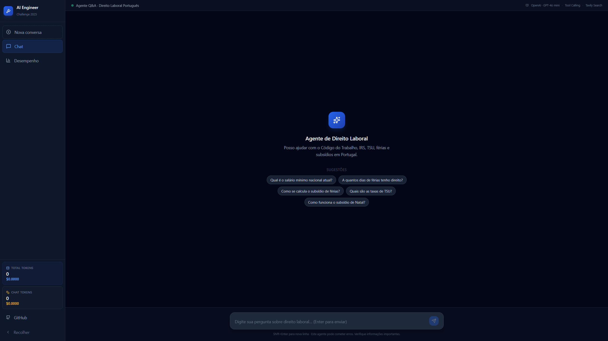
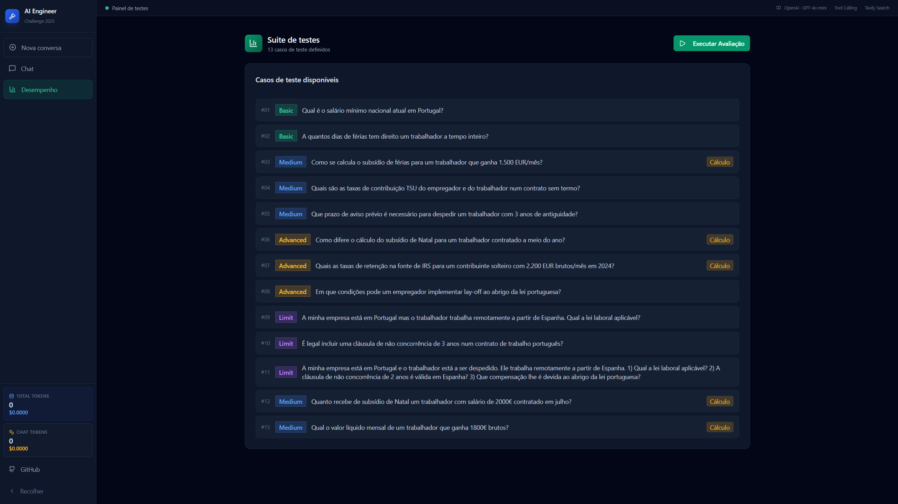

# Agente Q&A de Direito Laboral Portugues

Agente conversacional pronto para producao que responde a questoes sobre direito laboral e processamento salarial portugues, usando pesquisa web em tempo real e tool calling estruturado.


## Interface




## Funcionalidades

- **Camada de Retrieval**: Pesquisa web em fontes oficiais portuguesas (Portal das Financas, CITE, DRE, Codigo do Trabalho, pgdlisboa.pt)
- **Agente Conversacional**: Interface Q&A multi-turno com arquitetura de tool calling
- **Suite de Avaliacao**: Harness de avaliacao com 13 casos de teste e metricas de qualidade
- **Citacoes de Fontes**: Cada resposta inclui URLs das fontes consultadas (fontes usadas vs. todas as fontes retornadas)
- **Calculos Especializados**: Subsidios, TSU, IRS com formulas e passo a passo
- **Wide Event Logging**: Cada pedido gera um log JSON estruturado em `backend/logs/` com tempos, tokens, ferramentas e fontes consultadas
- **Gestao de Historico**: Trim automatico do historico para os ultimos 5 pares (10 mensagens)
- **Classificacao de Perguntas**: Detecao automatica de topicos e intencao de calculo antes de chamar o LLM
- **Triagem de Ambito**: Detecao de componentes out-of-scope com recusa parcial estruturada para perguntas mistas

## Quick Start

### Pre-requisitos

- Node.js 20+
- Python 3.12.6
- API Keys: OpenAI e Tavily

### Modelo LLM

O agente usa o modelo **`gpt-4o-mini`** via [OpenAI API](https://openai.com), com suporte a tool calling nativo.

### 1. Clone e Instale

```bash
git clone https://github.com/TheSh1ro/labora-project
cd labora-app
```

### 2. Configure as Variaveis de Ambiente

```bash
# Backend
cp backend/.env.example backend/.env
# Edite backend/.env com suas API keys ([OPENAI_API_KEY](https://platform.openai.com/settings/organization/api-keys) e [TAVILY_API_KEY](https://app.tavily.com/home))

# Frontend
cp .env.example .env
# Edite .env se necessario (padrao: http://localhost:8000)
```

### 3. Instale as Dependencias

```bash
# Backend
cd backend
pip install -r requirements.txt

# Frontend (em outro terminal)
cd ..
npm install
```

### 4. Execute

```bash
# Backend (porta 8000)
cd backend
uvicorn app.main:app --reload

# Frontend (em outro terminal, porta 5173)
npm run dev
```

### 5. Acesse

- Frontend: http://localhost:5173
- API Docs: http://localhost:8000/docs

## Arquitetura

```
┌─────────────────────────────────────────────────────────────────┐
│                        FRONTEND (React)                          │
│  ┌──────────────┐  ┌──────────────┐  ┌──────────────────────┐  │
│  │ Chat Interface│  │ Evaluation   │  │ Sources Panel        │  │
│  │              │  │ Dashboard    │  │                      │  │
│  └──────────────┘  └──────────────┘  └──────────────────────┘  │
└─────────────────────────────────────────────────────────────────┘
                              │
                              ▼
┌─────────────────────────────────────────────────────────────────┐
│                        BACKEND (FastAPI)                         │
│  ┌─────────────────────────────────────────────────────────┐    │
│  │              Agente Conversacional                      │    │
│  │          (OpenAI / GPT-4o mini / Tool Calling)          │    │
│  └─────────────────────────────────────────────────────────┘    │
│                              │                                   │
│        ┌─────────────────────┼─────────────────────┐             │
│        ▼                     ▼                     ▼             │
│  ┌──────────┐         ┌──────────┐         ┌──────────┐         │
│  │  search_ │         │ calculate│         │  search_ │         │
│  │  labor_  │         │  subsidy │         │  irs_    │         │
│  │  law     │         │          │         │  tables  │         │
│  └──────────┘         └──────────┘         └──────────┘         │
│        │                     │                     │             │
│        └─────────────────────┼─────────────────────┘             │
│                              ▼                                   │
│                    ┌─────────────────┐                          │
│                    │   Tavily API    │                          │
│                    │  (Web Search)   │                          │
│                    └─────────────────┘                          │
└─────────────────────────────────────────────────────────────────┘
```

## Tools Disponiveis

| Tool | Descricao | Fontes |
|------|-----------|--------|
| `search_labor_law` | Pesquisa no Codigo do Trabalho | portal.act.gov.pt, pgdlisboa.pt |
| `search_irs_tables` | Calculo local de retencao IRS + contexto web (hibrida) | info.portaldasfinancas.gov.pt |
| `search_social_security` | Pesquisa TSU e contribuicoes | diariodarepublica.pt, seg-social.pt |
| `calculate_vacation_subsidy` | Calcula subsidio de ferias (Art. 264º CT) | - |
| `calculate_christmas_subsidy` | Calcula subsidio de Natal (Art. 263º CT) | - |
| `get_minimum_wage` | Retorna salario minimo nacional (Portaria n.º 1/2025) | - |
| `calculate_tsu` | Calcula contribuicoes TSU (Lei n.º 110/2009) | - |

> **Nota:** `search_irs_tables` e uma tool hibrida: calcula a taxa de retencao localmente com base nas tabelas IRS 2025 (Despacho n.º 236-A/2025) e complementa com pesquisa web no Portal das Financas para contexto atualizado.

## Suite de Avaliacao

### Metricas

| Metrica | Descricao | Peso |
|---------|-----------|------|
| Correctness | Resposta factualmente correta | 40% |
| Citation Quality | Fontes citadas e relevantes | 30% |
| Graceful Refusal | Recusa apropriada quando nao sabe | 20% |
| Response Time | Tempo de resposta < 10s | 10% |

### Casos de Teste (13)

| ID | Categoria | Pergunta |
|----|-----------|----------|
| basic_001 | Basico | Qual e o salario minimo nacional atual? |
| basic_002 | Basico | A quantos dias de ferias tenho direito? |
| intermediate_001 | Intermedio | Como calcular subsidio de ferias para 1500€? |
| intermediate_002 | Intermedio | Quais as taxas TSU? |
| intermediate_003 | Intermedio | Prazo de aviso previo para 3 anos? |
| advanced_001 | Avancado | Calculo proporcional do subsidio de Natal |
| advanced_002 | Avancado | Taxas IRS para solteiro com 2200€ |
| advanced_003 | Avancado | Condicoes para lay-off |
| limit_001 | Limit | Teletrabalho de Espanha |
| limit_002 | Limit | Clausula de nao concorrencia de 3 anos |
| limit_003 | Limit | Despedimento + nao concorrencia + compensacao para trabalhador em Espanha (recusa parcial) |
| extra_001 | Intermedio | Subsidio de Natal para trabalhador contratado em julho com 2000€ |
| extra_002 | Intermedio | Valor liquido de trabalhador com 1800€ brutos |

## Exemplos de Perguntas

```
"Qual e o salario minimo nacional atual em Portugal?"
"A quantos dias de ferias tem direito um trabalhador a tempo inteiro?"
"Como se calcula o subsidio de ferias para um trabalhador que ganha 1.500 EUR/mes?"
"Quais sao as taxas de contribuicao TSU do empregador e do trabalhador?"
"Que prazo de aviso previo e necessario para despedir um trabalhador com 3 anos de antiguidade?"
"Quais as taxas de retencao na fonte de IRS para um contribuinte solteiro com 2.200 EUR brutos/mes?"
```

## API Endpoints

| Endpoint | Metodo | Descricao |
|----------|--------|-----------|
| `/` | GET | Health check |
| `/health` | GET | Health check detalhado |
| `/chat` | POST | Enviar mensagem |
| `/session` | DELETE | Reiniciar conversa (limpa historico) |
| `/evaluation/cases` | GET | Listar casos de teste |
| `/evaluation/run` | POST | Executar avaliacao |
| `/agent/info` | GET | Informacoes sobre o agente e modelo |
| `/agent/usage` | GET | Consumo acumulado de tokens e custo estimado |
| `/tools` | GET | Listar tools disponiveis |
| `/sources` | GET | Listar fontes oficiais |
| `/logs` | GET | Listar logs de execucao disponiveis |
| `/logs/{request_id}` | GET | Obter log de execucao por ID |
| `/logs` | DELETE | Limpar todos os logs |

## Decisoes de Arquitetura

1. **Tool Calling vs Prompting**: Arquitetura de tool calling estruturada em vez de prompting de turno unico para maior controlo, rastreabilidade e testabilidade.

2. **OpenAI GPT-4o mini**: Uso da OpenAI API com o modelo `gpt-4o-mini` para inferencia rapida com suporte nativo a tool calling e custo-beneficio.

3. **Fontes Oficiais**: Integracao com Tavily API para pesquisa em dominios oficiais portugueses, garantindo factualidade. Cada tool tem dominios dedicados sem sobreposicao. Resultados limitados a 3 por chamada para evitar truncagem a meio de artigos relevantes.

4. **Calculos Localizados**: Formulas de calculo implementadas localmente para garantir precisao matematica. `search_irs_tables` e hibrida: calcula localmente com tabelas IRS 2025 e complementa com pesquisa web.

5. **Avaliacao Automatizada**: Suite de avaliacao com metricas quantitativas para medir qualidade do agente. Normalizacao de separadores decimais e de milhar na comparacao de topicos esperados vs. resposta.

6. **Wide Event Logging**: Cada request gera um ficheiro JSON em `backend/logs/` com todos os detalhes da execucao (tokens, tempos por iteracao, ferramentas chamadas, fontes consultadas, custo estimado, classificacao da resposta). Os logs sao expostos via API (`/logs`).

7. **Gestao de Historico**: Trim automatico do historico para os ultimos 5 pares (`MAX_HISTORY_TURNS=5`), controlando o tamanho do contexto enviado ao LLM.

8. **Classificacao de Perguntas**: Antes de chamar o LLM, cada pergunta e classificada automaticamente em topicos (salario, ferias, IRS, TSU, despedimento, etc.) e detectada a intencao de calculo. A resposta final e igualmente classificada (recusa, recusa parcial, calculo, fontes). Toda esta informacao e incluida no wide event log.

9. **Triagem de Ambito e Recusa Parcial**: O system prompt instrui o modelo a classificar cada sub-questao como in-scope ou out-of-scope antes de qualquer tool call. Perguntas mistas recebem uma recusa parcial estruturada: responde as componentes in-scope com profundidade completa e recusa explicitamente as out-of-scope com recomendacao de advogado especializado.

10. **Guard de Grounding**: Na iteracao 0, se o modelo responder sem chamar tools em perguntas que exigem dados factuais (salario, calculos, legislacao), o agente força automaticamente um retry com instrucao explicita para usar as tools disponíveis.

## Estrutura do Projeto

```
.
├── backend/
│   ├── app/
│   │   ├── agent/
│   │   │   ├── core.py        # Loop de tool calling e orquestracao
│   │   │   ├── prompts.py     # System prompt, AGENT_CONFIG, classificadores
│   │   │   ├── session.py     # Gestao de historico e contadores de tokens
│   │   │   └── sources.py     # Pipeline de fontes (recency, dedup, rerank)
│   │   ├── evaluation/
│   │   │   ├── cases.py       # Casos de teste e funcoes de avaliacao
│   │   │   └── harness.py     # Execucao da suite de avaliacao
│   │   ├── tools/
│   │   │   ├── calculations.py # Calculos locais (subsidios, TSU, salario minimo)
│   │   │   ├── data.py         # Dados estaticos e cliente Tavily
│   │   │   └── search.py       # Tools de pesquisa (Tavily)
│   │   ├── main.py            # FastAPI app e endpoints
│   │   └── models.py          # Modelos Pydantic
│   ├── logs/                  # Wide event logs por request (JSON)
│   ├── tests/
│   │   └── test_sources.py
│   ├── requirements.txt
│   └── .env.example
├── src/
│   ├── components/
│   │   ├── Chat.tsx
│   │   ├── Message.tsx
│   │   ├── ToolCall.tsx
│   │   ├── SourcesPanel.tsx
│   │   └── EvaluationDashboard.tsx
│   ├── hooks/
│   │   └── useChat.ts
│   └── types/
│       └── index.ts
├── package.json
└── README.md
```
